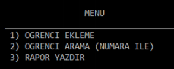
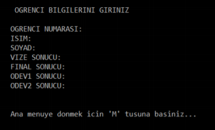
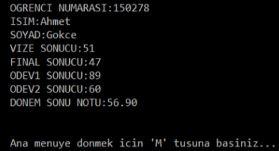
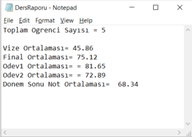

# SinavProjesi

1. <u><b>ogrenci</b></u> isminde bir struct (yapı) tanımlayıp, içinde aşağıdaki alanları kendi değişken isimlerinizle
uygun veri tiplerinde oluşturduk.
   + Öğrenci Numarası
   + İsim
   + Soyadı
   + Vize sonucu
   + Final sonucu
   + Ödev1 sonucu
   + Ödev2 sonucu
   + Dönem Sonu Notu (Vize %25 +Final %40 + Ödev1 %15 + Ödev2 %20 alınarak otomatik
hesaplanacaktır)
1. İçinde ogrenci tipinde elemanları bulunduracak <u><b>100 elemanlı bir dizimiz</b></u> var.
1. Aşağıdaki şekilde bir program menüsü oluşturuldu.
   

 4. <u><b>ÖĞRENCİ EKLEME</b></u> 
Öğrenci Ekleme işlemi iki şekilde çalışabilecektir: 

    a. Eğer program parametresiz çalıştırılmışsa, öğrenci bilgilerinin giriş işlemini klavyeden
manuel ile yapınız. İstediğiniz sayıda (max 100) kayıt girişi yapabilirsiniz.

Bu bilgiler girildikten sonra, öğrencinin <u><b>dönem sonu notu hesaplanarak</b></u> kaydı yapılacaktır.

 b. Eğer program <u><b>main.exe</b></u>  <u><b>ogrenciListesi.txt</b></u>  şeklinde parametreli olarak çalıştırılmışsa,
öğrenci bilgi işlemini otomatik olarak ogrenciListesi.txt dosyasından okuyarak yapınız.
Her öğrencinin <u><b>dönem sonu notu hesaplanarak</b></u> kaydı yapılacaktır. (programınızın ismi
main.c varsayılmıştır ve ogrenciListesi.txt dosyası ödev ile birlikte verilecektir. Dosyadaki
bilgiler sırasıyla : Öğrenci Numarası, İsim, Soyad, Vize sonucu, Final sonucu, Ödev1
sonucu, Ödev2 sonucu içermektedir)

5. <u><b>ÖĞRENCİ ARAMA</b></u>
Öğrenci arama işlemi sadece öğrenci numarası ile yapılacaktır. Her öğrenci için tek bir
bulunacaktır, sistemde aynı numaradan iki öğrenci olmayacaktır.
Arama sonucunda öğrenci bulunmuşsa, bilgileri ekrana getirelecektir.
Arama sonucunda öğrenci bulunmamışsa, “KAYIT BULUNAMADI” mesajı verilecektir.
Her iki durum sonucunda da, klavyeden ‘M’ tuşu ile ana menüye dönüş sağlanacaktır.

6. <u><b>RAPOR YAZDIR</b></u> 
Sınıfın öğrenci sayısı, vize ortalaması, final ortalaması, ödev1 ortalaması, ödev2 ortalaması ve dönem sonu
not ortalaması <u><b>DersRaporu.txt</b></u> isimli bir dosyaya yazdıralacaktır.

